# Ultimate Refriz Frames Project

## Data importing and cleaning
(To see associated experimental stimuli script, [go here](https://bitbucket.org/smweis/frizrf/overview)
We import the necessary modules, and one custom function that wraps up data importing.


```python
#Load and clean data.

%matplotlib inline
import numpy as np
import matplotlib.pyplot as plt
import seaborn as sns
import pandas as pd
import scipy
import statsmodels.api as sm
#import statsmodels.formula.api as smf

#custom function to import data: See here: https://github.com/smweis/Ultimate
from importData import getData

#Get Data
frizData = getData('C:\\Users\\stweis\\Dropbox\\Penn Post Doc\\Frisbee_Ref_Frames\\data\\batch1\\friz_clean')
navData = getData('C:\\Users\\stweis\\Dropbox\\Penn Post Doc\\Frisbee_Ref_Frames\\data\\batch1\\nav_clean')
additionalData = pd.read_excel('C:\\Users\\stweis\\Dropbox\\Penn Post Doc\\Frisbee_Ref_Frames\\data\\batch1\\additionalData_For_Python.xlsx',header=0)
#Recode "psychopycode to participant"
additionalData['participant'] = additionalData['psychopycode']

#Clean data functions
def removeHighRTs(howManySDs,dv,data):
    rtThresh = howManySDs*np.std(data[dv])
    rtMean = np.mean(data[dv])
    dataThresh = data.loc[data[dv] < (rtMean + rtThresh)]
    dataThresh = dataThresh.loc[dataThresh[dv] > 0]
    return dataThresh


def removeWrongAnswers(dv,data):
    dataCorrect = data.loc[data[dv] == 1]
    return dataCorrect


def renameFactorLevels(data,friz_or_nav):
    data['condition'] = friz_or_nav
    prompts = sorted(data.prompt1.unique())
    stims = sorted(data.stim1.unique())
    new_stims = ['far_left','far_right','near_left','near_right']

    if friz_or_nav == 'friz':    
        new_prompts = ['Away','Left','Right','Home']
    else:
        new_prompts = ['Away','Home','Left','Right']
        
    for i in range(len(prompts)):
        data = data.replace(prompts[i],new_prompts[i])
        data = data.replace(stims[i],new_stims[i])
        
    return data


def newFactorPrompts(row):
    if row['prompt1'] == 'Home' or row['prompt1'] == 'Away':
        return 'Absolute'
    else:
        return 'Relative'

    
def newFactorStims(row):
    if row['stim1'] == 'near_right' or row['stim1'] == 'near_left':
        return 'Near'
    else:
        return 'Far'

    

#Rename conditions
frizData = renameFactorLevels(frizData,'Frisbee')
navData = renameFactorLevels(navData,'Navigation')
#Recode stimulus location to a binary variable.
frizData['stimLoc'] = frizData.apply(lambda row: newFactorStims(row),axis=1)
navData['stimLoc'] = navData.apply(lambda row: newFactorStims(row),axis=1)
#Recode prompt type to a binary variable. 
frizData['promptType'] = frizData.apply(lambda row: newFactorPrompts(row),axis=1)
navData['promptType'] = navData.apply(lambda row: newFactorPrompts(row),axis=1)


unthreshed_data = frizData.append(navData)

neccessaryAdditionalData = additionalData.loc[:,
                                              ["Sex","participant",
                                               "SBSOD_AVERAGE",
                                               "Friz_Total_Years_Played",
                                               "Friz_Force_Preference",
                                               "Friz_Position"]]

  
```

    C:\Users\stweis\AppData\Local\Continuum\anaconda3\lib\site-packages\statsmodels\compat\pandas.py:56: FutureWarning: The pandas.core.datetools module is deprecated and will be removed in a future version. Please use the pandas.tseries module instead.
      from pandas.core import datetools
    

## Weirdness in correct answers!

Before we continue, observe something strange. 

People are generally very good at this task....except for when it is a navigation task with a "Go Home" 
or "Go Away" prompt, and the navigator is on the far side of the screen.

It appears as though some people interpreted the "Go Home" question as turning in the direction that the navigator should turn, 
rather than the direction relative to the responder.


```python
#Correct answer strangeness!
pivotedCorrectAns = unthreshed_data.pivot_table(index='participant',columns=['condition','stimLoc','promptType'],
                                  values='Trials_responsecorr',aggfunc=np.sum)

pivotedRT = unthreshed_data.pivot_table(index='participant',columns=['condition','stimLoc','promptType'],
                                  values='Trials_responsert',aggfunc=np.mean)
def addPivots(pivoted):
    pivoted['Frisbee_Rel_minus_Abs_Far'] = pivoted['Frisbee']['Far']['Relative'] - pivoted['Frisbee']['Far']['Absolute']
    pivoted['Frisbee_Rel_minus_Abs_Near'] = pivoted['Frisbee']['Near']['Relative'] - pivoted['Frisbee']['Near']['Absolute']
    pivoted['Frisbee_Rel_minus_Abs'] = (pivoted['Frisbee_Rel_minus_Abs_Far'] + pivoted['Frisbee_Rel_minus_Abs_Near'])/2
    pivoted['Nav_Rel_minus_Abs_Far'] = pivoted['Navigation']['Far']['Relative'] - pivoted['Navigation']['Far']['Absolute']
    pivoted['Nav_Rel_minus_Abs_Near'] = pivoted['Navigation']['Near']['Relative'] - pivoted['Navigation']['Near']['Absolute']
    pivoted['Nav_Rel_minus_Abs'] = (pivoted['Nav_Rel_minus_Abs_Far'] + pivoted['Nav_Rel_minus_Abs_Near'])/2
    
addPivots(pivotedRT)

ax2 = sns.factorplot(x = "prompt1", y = "Trials_responsecorr", data = unthreshed_data, hue = "stim1", palette=['red','salmon','blue','dodgerblue'],
                    kind = "point", size = 8,col='condition', order=['Right','Left','Away','Home'], hue_order=['near_right','near_left','far_right','far_left'])

ax2.set(xlabel='Prompt Label', ylabel='Correct Answer Percent')
ax2.set_titles("{col_name} Condition")

plt.show()

```


## Re-coding "correct" and who flipped that, and other data cleaning

A closer look reveals that about 1/3 of participants spontaneously answered the Absolute questions "backward" when the navigator was facing them! 


```python
display(pivotedCorrectAns)

```


<div>
<style scoped>
    .dataframe tbody tr th:only-of-type {
        vertical-align: middle;
    }

    .dataframe tbody tr th {
        vertical-align: top;
    }

    .dataframe thead tr th {
        text-align: left;
    }

    .dataframe thead tr:last-of-type th {
        text-align: right;
    }
</style>
<table border="1" class="dataframe">
  <thead>
    <tr>
      <th>condition</th>
      <th colspan="4" halign="left">Frisbee</th>
      <th colspan="4" halign="left">Navigation</th>
    </tr>
    <tr>
      <th>stimLoc</th>
      <th colspan="2" halign="left">Far</th>
      <th colspan="2" halign="left">Near</th>
      <th colspan="2" halign="left">Far</th>
      <th colspan="2" halign="left">Near</th>
    </tr>
    <tr>
      <th>promptType</th>
      <th>Absolute</th>
      <th>Relative</th>
      <th>Absolute</th>
      <th>Relative</th>
      <th>Absolute</th>
      <th>Relative</th>
      <th>Absolute</th>
      <th>Relative</th>
    </tr>
    <tr>
      <th>participant</th>
      <th></th>
      <th></th>
      <th></th>
      <th></th>
      <th></th>
      <th></th>
      <th></th>
      <th></th>
    </tr>
  </thead>
  <tbody>
    <tr>
      <th>21208596</th>
      <td>16.0</td>
      <td>16.0</td>
      <td>15.0</td>
      <td>16.0</td>
      <td>16.0</td>
      <td>15.0</td>
      <td>15.0</td>
      <td>16.0</td>
    </tr>
    <tr>
      <th>2189950</th>
      <td>15.0</td>
      <td>16.0</td>
      <td>15.0</td>
      <td>15.0</td>
      <td>16.0</td>
      <td>13.0</td>
      <td>16.0</td>
      <td>16.0</td>
    </tr>
    <tr>
      <th>22363073</th>
      <td>16.0</td>
      <td>16.0</td>
      <td>16.0</td>
      <td>16.0</td>
      <td>16.0</td>
      <td>16.0</td>
      <td>16.0</td>
      <td>15.0</td>
    </tr>
    <tr>
      <th>24523564</th>
      <td>16.0</td>
      <td>16.0</td>
      <td>16.0</td>
      <td>16.0</td>
      <td>16.0</td>
      <td>14.0</td>
      <td>16.0</td>
      <td>16.0</td>
    </tr>
    <tr>
      <th>26044874</th>
      <td>16.0</td>
      <td>15.0</td>
      <td>16.0</td>
      <td>16.0</td>
      <td>1.0</td>
      <td>15.0</td>
      <td>15.0</td>
      <td>16.0</td>
    </tr>
    <tr>
      <th>28057826</th>
      <td>15.0</td>
      <td>14.0</td>
      <td>15.0</td>
      <td>16.0</td>
      <td>15.0</td>
      <td>15.0</td>
      <td>16.0</td>
      <td>15.0</td>
    </tr>
    <tr>
      <th>30426108</th>
      <td>16.0</td>
      <td>16.0</td>
      <td>15.0</td>
      <td>15.0</td>
      <td>6.0</td>
      <td>16.0</td>
      <td>16.0</td>
      <td>16.0</td>
    </tr>
    <tr>
      <th>32670019</th>
      <td>16.0</td>
      <td>15.0</td>
      <td>15.0</td>
      <td>16.0</td>
      <td>16.0</td>
      <td>15.0</td>
      <td>16.0</td>
      <td>15.0</td>
    </tr>
    <tr>
      <th>34545091</th>
      <td>16.0</td>
      <td>16.0</td>
      <td>15.0</td>
      <td>16.0</td>
      <td>5.0</td>
      <td>15.0</td>
      <td>16.0</td>
      <td>16.0</td>
    </tr>
    <tr>
      <th>36148861</th>
      <td>16.0</td>
      <td>16.0</td>
      <td>16.0</td>
      <td>15.0</td>
      <td>15.0</td>
      <td>15.0</td>
      <td>16.0</td>
      <td>16.0</td>
    </tr>
    <tr>
      <th>3651739</th>
      <td>16.0</td>
      <td>16.0</td>
      <td>16.0</td>
      <td>16.0</td>
      <td>16.0</td>
      <td>13.0</td>
      <td>16.0</td>
      <td>16.0</td>
    </tr>
    <tr>
      <th>3771103</th>
      <td>16.0</td>
      <td>16.0</td>
      <td>16.0</td>
      <td>16.0</td>
      <td>1.0</td>
      <td>16.0</td>
      <td>16.0</td>
      <td>16.0</td>
    </tr>
    <tr>
      <th>38638936</th>
      <td>16.0</td>
      <td>13.0</td>
      <td>13.0</td>
      <td>15.0</td>
      <td>5.0</td>
      <td>13.0</td>
      <td>14.0</td>
      <td>15.0</td>
    </tr>
    <tr>
      <th>3880734</th>
      <td>16.0</td>
      <td>16.0</td>
      <td>16.0</td>
      <td>16.0</td>
      <td>16.0</td>
      <td>13.0</td>
      <td>16.0</td>
      <td>16.0</td>
    </tr>
    <tr>
      <th>40119543</th>
      <td>16.0</td>
      <td>16.0</td>
      <td>16.0</td>
      <td>16.0</td>
      <td>16.0</td>
      <td>16.0</td>
      <td>16.0</td>
      <td>16.0</td>
    </tr>
    <tr>
      <th>40321903</th>
      <td>15.0</td>
      <td>15.0</td>
      <td>16.0</td>
      <td>16.0</td>
      <td>1.0</td>
      <td>14.0</td>
      <td>16.0</td>
      <td>16.0</td>
    </tr>
    <tr>
      <th>40632896</th>
      <td>16.0</td>
      <td>16.0</td>
      <td>16.0</td>
      <td>16.0</td>
      <td>16.0</td>
      <td>16.0</td>
      <td>16.0</td>
      <td>16.0</td>
    </tr>
    <tr>
      <th>41685255</th>
      <td>15.0</td>
      <td>16.0</td>
      <td>16.0</td>
      <td>16.0</td>
      <td>15.0</td>
      <td>16.0</td>
      <td>16.0</td>
      <td>16.0</td>
    </tr>
    <tr>
      <th>43843481</th>
      <td>15.0</td>
      <td>16.0</td>
      <td>15.0</td>
      <td>16.0</td>
      <td>16.0</td>
      <td>15.0</td>
      <td>16.0</td>
      <td>16.0</td>
    </tr>
    <tr>
      <th>44376975</th>
      <td>10.0</td>
      <td>11.0</td>
      <td>16.0</td>
      <td>15.0</td>
      <td>3.0</td>
      <td>16.0</td>
      <td>15.0</td>
      <td>16.0</td>
    </tr>
    <tr>
      <th>44643324</th>
      <td>14.0</td>
      <td>16.0</td>
      <td>15.0</td>
      <td>15.0</td>
      <td>16.0</td>
      <td>13.0</td>
      <td>16.0</td>
      <td>16.0</td>
    </tr>
    <tr>
      <th>49320823</th>
      <td>16.0</td>
      <td>16.0</td>
      <td>15.0</td>
      <td>14.0</td>
      <td>3.0</td>
      <td>16.0</td>
      <td>15.0</td>
      <td>16.0</td>
    </tr>
    <tr>
      <th>49541095</th>
      <td>16.0</td>
      <td>16.0</td>
      <td>16.0</td>
      <td>16.0</td>
      <td>16.0</td>
      <td>14.0</td>
      <td>16.0</td>
      <td>16.0</td>
    </tr>
    <tr>
      <th>52817250</th>
      <td>16.0</td>
      <td>16.0</td>
      <td>14.0</td>
      <td>15.0</td>
      <td>4.0</td>
      <td>16.0</td>
      <td>16.0</td>
      <td>16.0</td>
    </tr>
    <tr>
      <th>55421948</th>
      <td>15.0</td>
      <td>16.0</td>
      <td>16.0</td>
      <td>16.0</td>
      <td>1.0</td>
      <td>14.0</td>
      <td>15.0</td>
      <td>16.0</td>
    </tr>
    <tr>
      <th>55572456</th>
      <td>15.0</td>
      <td>16.0</td>
      <td>16.0</td>
      <td>16.0</td>
      <td>16.0</td>
      <td>15.0</td>
      <td>16.0</td>
      <td>16.0</td>
    </tr>
    <tr>
      <th>56499208</th>
      <td>16.0</td>
      <td>16.0</td>
      <td>15.0</td>
      <td>16.0</td>
      <td>13.0</td>
      <td>10.0</td>
      <td>16.0</td>
      <td>16.0</td>
    </tr>
    <tr>
      <th>56594642</th>
      <td>16.0</td>
      <td>16.0</td>
      <td>16.0</td>
      <td>16.0</td>
      <td>3.0</td>
      <td>16.0</td>
      <td>16.0</td>
      <td>15.0</td>
    </tr>
    <tr>
      <th>58799837</th>
      <td>16.0</td>
      <td>16.0</td>
      <td>16.0</td>
      <td>16.0</td>
      <td>4.0</td>
      <td>16.0</td>
      <td>16.0</td>
      <td>15.0</td>
    </tr>
    <tr>
      <th>58839785</th>
      <td>16.0</td>
      <td>16.0</td>
      <td>15.0</td>
      <td>16.0</td>
      <td>9.0</td>
      <td>13.0</td>
      <td>16.0</td>
      <td>16.0</td>
    </tr>
    <tr>
      <th>60510916</th>
      <td>16.0</td>
      <td>16.0</td>
      <td>15.0</td>
      <td>16.0</td>
      <td>15.0</td>
      <td>14.0</td>
      <td>16.0</td>
      <td>16.0</td>
    </tr>
    <tr>
      <th>6061126</th>
      <td>16.0</td>
      <td>16.0</td>
      <td>16.0</td>
      <td>16.0</td>
      <td>9.0</td>
      <td>16.0</td>
      <td>16.0</td>
      <td>16.0</td>
    </tr>
    <tr>
      <th>61216562</th>
      <td>16.0</td>
      <td>15.0</td>
      <td>16.0</td>
      <td>16.0</td>
      <td>16.0</td>
      <td>12.0</td>
      <td>15.0</td>
      <td>16.0</td>
    </tr>
    <tr>
      <th>61853264</th>
      <td>15.0</td>
      <td>16.0</td>
      <td>13.0</td>
      <td>16.0</td>
      <td>4.0</td>
      <td>16.0</td>
      <td>16.0</td>
      <td>16.0</td>
    </tr>
    <tr>
      <th>62228828</th>
      <td>14.0</td>
      <td>16.0</td>
      <td>14.0</td>
      <td>16.0</td>
      <td>16.0</td>
      <td>14.0</td>
      <td>16.0</td>
      <td>15.0</td>
    </tr>
    <tr>
      <th>63506070</th>
      <td>16.0</td>
      <td>16.0</td>
      <td>16.0</td>
      <td>16.0</td>
      <td>1.0</td>
      <td>15.0</td>
      <td>14.0</td>
      <td>16.0</td>
    </tr>
    <tr>
      <th>63854690</th>
      <td>16.0</td>
      <td>15.0</td>
      <td>15.0</td>
      <td>16.0</td>
      <td>16.0</td>
      <td>14.0</td>
      <td>16.0</td>
      <td>15.0</td>
    </tr>
    <tr>
      <th>64024983</th>
      <td>13.0</td>
      <td>16.0</td>
      <td>14.0</td>
      <td>16.0</td>
      <td>16.0</td>
      <td>15.0</td>
      <td>16.0</td>
      <td>16.0</td>
    </tr>
    <tr>
      <th>6421150</th>
      <td>16.0</td>
      <td>16.0</td>
      <td>16.0</td>
      <td>16.0</td>
      <td>1.0</td>
      <td>14.0</td>
      <td>15.0</td>
      <td>15.0</td>
    </tr>
    <tr>
      <th>64490590</th>
      <td>16.0</td>
      <td>16.0</td>
      <td>16.0</td>
      <td>16.0</td>
      <td>3.0</td>
      <td>15.0</td>
      <td>16.0</td>
      <td>16.0</td>
    </tr>
    <tr>
      <th>64824344</th>
      <td>16.0</td>
      <td>16.0</td>
      <td>16.0</td>
      <td>16.0</td>
      <td>16.0</td>
      <td>16.0</td>
      <td>16.0</td>
      <td>16.0</td>
    </tr>
    <tr>
      <th>67096388</th>
      <td>15.0</td>
      <td>16.0</td>
      <td>16.0</td>
      <td>16.0</td>
      <td>16.0</td>
      <td>14.0</td>
      <td>16.0</td>
      <td>16.0</td>
    </tr>
    <tr>
      <th>68116738</th>
      <td>16.0</td>
      <td>16.0</td>
      <td>16.0</td>
      <td>16.0</td>
      <td>1.0</td>
      <td>16.0</td>
      <td>16.0</td>
      <td>15.0</td>
    </tr>
    <tr>
      <th>72765732</th>
      <td>15.0</td>
      <td>16.0</td>
      <td>16.0</td>
      <td>15.0</td>
      <td>15.0</td>
      <td>12.0</td>
      <td>16.0</td>
      <td>16.0</td>
    </tr>
    <tr>
      <th>78764541</th>
      <td>16.0</td>
      <td>16.0</td>
      <td>16.0</td>
      <td>16.0</td>
      <td>16.0</td>
      <td>15.0</td>
      <td>16.0</td>
      <td>16.0</td>
    </tr>
    <tr>
      <th>7889786</th>
      <td>15.0</td>
      <td>16.0</td>
      <td>15.0</td>
      <td>16.0</td>
      <td>16.0</td>
      <td>16.0</td>
      <td>16.0</td>
      <td>16.0</td>
    </tr>
    <tr>
      <th>80113241</th>
      <td>16.0</td>
      <td>16.0</td>
      <td>16.0</td>
      <td>16.0</td>
      <td>16.0</td>
      <td>16.0</td>
      <td>16.0</td>
      <td>16.0</td>
    </tr>
    <tr>
      <th>81058337</th>
      <td>16.0</td>
      <td>16.0</td>
      <td>16.0</td>
      <td>15.0</td>
      <td>16.0</td>
      <td>13.0</td>
      <td>16.0</td>
      <td>16.0</td>
    </tr>
    <tr>
      <th>82427599</th>
      <td>16.0</td>
      <td>16.0</td>
      <td>15.0</td>
      <td>15.0</td>
      <td>15.0</td>
      <td>15.0</td>
      <td>16.0</td>
      <td>16.0</td>
    </tr>
    <tr>
      <th>86763169</th>
      <td>16.0</td>
      <td>16.0</td>
      <td>16.0</td>
      <td>16.0</td>
      <td>16.0</td>
      <td>16.0</td>
      <td>16.0</td>
      <td>16.0</td>
    </tr>
    <tr>
      <th>90544723</th>
      <td>16.0</td>
      <td>16.0</td>
      <td>16.0</td>
      <td>16.0</td>
      <td>15.0</td>
      <td>16.0</td>
      <td>16.0</td>
      <td>16.0</td>
    </tr>
    <tr>
      <th>91021895</th>
      <td>16.0</td>
      <td>13.0</td>
      <td>14.0</td>
      <td>16.0</td>
      <td>15.0</td>
      <td>13.0</td>
      <td>15.0</td>
      <td>16.0</td>
    </tr>
    <tr>
      <th>92676929</th>
      <td>16.0</td>
      <td>15.0</td>
      <td>15.0</td>
      <td>16.0</td>
      <td>15.0</td>
      <td>15.0</td>
      <td>15.0</td>
      <td>16.0</td>
    </tr>
    <tr>
      <th>9495124</th>
      <td>15.0</td>
      <td>16.0</td>
      <td>16.0</td>
      <td>16.0</td>
      <td>16.0</td>
      <td>14.0</td>
      <td>16.0</td>
      <td>14.0</td>
    </tr>
    <tr>
      <th>95173719</th>
      <td>16.0</td>
      <td>13.0</td>
      <td>14.0</td>
      <td>15.0</td>
      <td>15.0</td>
      <td>10.0</td>
      <td>14.0</td>
      <td>15.0</td>
    </tr>
    <tr>
      <th>97924102</th>
      <td>16.0</td>
      <td>16.0</td>
      <td>16.0</td>
      <td>16.0</td>
      <td>16.0</td>
      <td>15.0</td>
      <td>16.0</td>
      <td>16.0</td>
    </tr>
    <tr>
      <th>98888826</th>
      <td>16.0</td>
      <td>16.0</td>
      <td>16.0</td>
      <td>16.0</td>
      <td>16.0</td>
      <td>15.0</td>
      <td>15.0</td>
      <td>15.0</td>
    </tr>
    <tr>
      <th>99990726</th>
      <td>16.0</td>
      <td>15.0</td>
      <td>16.0</td>
      <td>16.0</td>
      <td>16.0</td>
      <td>16.0</td>
      <td>16.0</td>
      <td>16.0</td>
    </tr>
  </tbody>
</table>
</div>


### It turns out, there are a few differences between these groups. 

For one thing, flippers are much slower on Nav/Absolute/Far tasks compared to nonflippers.

For another thing, they are more likely to prefer referring to the force as "Force Home/Away."


```python
#Differences between flippers and nonflippers
a = pivotedCorrectAns[('Navigation','Far','Absolute')]< 8
flippersRT = pivotedRT[a]
nonflippersRT = pivotedRT[~a]

t = []
p = []
for i,j in enumerate(flippersRT):
    if flippersRT[j].dtype == 'float64':
        t,p = scipy.stats.ttest_ind(flippersRT[j],nonflippersRT[j])
        jPrint = '{}, {}, {}:'.format(j[0],j[1],j[2])
        if p < .05:
            p = '{:.4f}'.format(p)
        else:
            p = '{:.2f}'.format(p)
        display('{} Flipper Mean = {:.2f}, NonFlipper Mean = {:.2f}, t = {:.2f}, p = {}'.format(jPrint,np.mean(flippersRT[j]),np.mean(nonflippersRT[j]),t,p))

if 'participant' in neccessaryAdditionalData.columns:
    neccessaryAdditionalData.set_index('participant',inplace=True)

neccessaryAdditionalData.index = neccessaryAdditionalData.index.map(str)
neccessaryAdditionalData.sort_index(inplace=True)
a.sort_index(inplace=True)

flippers = neccessaryAdditionalData[a]
nonflippers = neccessaryAdditionalData[~a]


display(flippers.groupby('Friz_Force_Preference')['Friz_Position'].count())
display(nonflippers.groupby('Friz_Force_Preference')['Friz_Position'].count())


```


    'Frisbee, Far, Absolute: Flipper Mean = 1.45, NonFlipper Mean = 1.27, t = 1.11, p = 0.27'


    'Frisbee, Far, Relative: Flipper Mean = 1.30, NonFlipper Mean = 1.16, t = 0.97, p = 0.33'


    'Frisbee, Near, Absolute: Flipper Mean = 1.33, NonFlipper Mean = 1.20, t = 1.07, p = 0.29'


    'Frisbee, Near, Relative: Flipper Mean = 1.24, NonFlipper Mean = 1.10, t = 1.00, p = 0.32'


    'Navigation, Far, Absolute: Flipper Mean = 1.58, NonFlipper Mean = 1.09, t = 3.53, p = 0.0008'


    'Navigation, Far, Relative: Flipper Mean = 1.34, NonFlipper Mean = 1.38, t = -0.30, p = 0.76'


    'Navigation, Near, Absolute: Flipper Mean = 1.01, NonFlipper Mean = 0.86, t = 2.05, p = 0.0449'


    'Navigation, Near, Relative: Flipper Mean = 0.90, NonFlipper Mean = 0.93, t = -0.31, p = 0.76'


    'Frisbee_Rel_minus_Abs_Far, , : Flipper Mean = -0.15, NonFlipper Mean = -0.11, t = -0.77, p = 0.44'


    'Frisbee_Rel_minus_Abs_Near, , : Flipper Mean = -0.09, NonFlipper Mean = -0.10, t = 0.20, p = 0.84'


    'Frisbee_Rel_minus_Abs, , : Flipper Mean = -0.12, NonFlipper Mean = -0.11, t = -0.22, p = 0.83'


    'Nav_Rel_minus_Abs_Far, , : Flipper Mean = -0.23, NonFlipper Mean = 0.30, t = -5.59, p = 0.0000'


    'Nav_Rel_minus_Abs_Near, , : Flipper Mean = -0.11, NonFlipper Mean = 0.07, t = -2.94, p = 0.0048'


    'Nav_Rel_minus_Abs, , : Flipper Mean = -0.17, NonFlipper Mean = 0.18, t = -5.34, p = 0.0000'


    Friz_Force_Preference
    Forehand / Backhand     2
    Home / Away            13
    Name: Friz_Position, dtype: int64


    Friz_Force_Preference
    Forehand / Backhand    17
    Home / Away            19
    Name: Friz_Position, dtype: int64


### Now that we know that, we are going to recode each flipper's Absolute Navigation Far answers to be reversed. 

We will eventually create 4 datasets.

**unthreshed_data** -> The raw uncorrected data.

**reversed_correct** -> Th data after Flippers' answers have been corrected.

**thresholded_data** -> High RTs removed.

**reversed_correct_thresholded_data** -> High RTs and incorrect trials removed (from Flipper-corrected data).


**dataForPlot** -> Set below - the data that will be displayed. 


```python
#Reverse correct answers for flippers
a = flippers.index.values.tolist()
df = unthreshed_data
df['flipper'] = np.where(df.participant.isin(a),'flipper','nonflipper')

def f(df):
    if df['flipper'] == 'flipper' and df['condition'] == 'Navigation' and df['stimLoc'] == 'Far' and df['promptType'] == 'Absolute':
        if df['Trials_responsecorr'] == 1: return 0
        elif df['Trials_responsecorr'] == 0: return 1
    else:
        return df['Trials_responsecorr']
        

df['newCorrect'] = df.apply(f, axis=1)

reversedCorrect = df
```


```python
while True:
    try:
        whatSTD = float(input("How many SDs to trim? "))
        break
    except ValueError:
        print("Pick a valid number (floats OK)")

#Threshold data at 2 RT's above mean.
thresholded_data = removeHighRTs(whatSTD, 'newCorrect',reversedCorrect)

reversed_correct_thresholded_data = removeWrongAnswers('newCorrect',reversedCorrect)

```

    How many SDs to trim? 2
    


```python
def chooseYourData():

    while True:
        try:
            whichData = int(input("All trials = 1, HighRTs Removed = 2, HighRTs and Incorrects Removed = 3 "))
            break
        except ValueError:
            print("Pick 1 through 3")
    if whichData == 1:
        dfp = reversedCorrect
    elif whichData == 2:
        dfp = thresholded_data
    elif whichData == 3:
        dfp = reversed_correct_thresholded_data
    else:
        chooseYourData()

    return dfp

dataForPlot = chooseYourData()
```

    All trials = 1, HighRTs Removed = 2, HighRTs and Incorrects Removed = 3 3
    


```python
#Pivot and recode data. This pivots the data so we can plot it! It also creates some useful contrasts
#The result of this cell is a pivoted dataset called all pivoted, and a merged dataset called allpivots

pivoted = dataForPlot.pivot_table(index='participant',columns=['condition','stimLoc','promptType'],
                                  values='Trials_responsert',aggfunc=np.mean)

for i in pivoted.isnull().sum():
    if i > 0:
        print("We had to drop ",i," cells from pivoted because they have no data.")

pivoted = pivoted.dropna() #otherwise this won't work - so some data is missing

pivoted['Frisbee_Rel_minus_Abs_Far'] = pivoted['Frisbee']['Far']['Relative'] - pivoted['Frisbee']['Far']['Absolute']
pivoted['Frisbee_Rel_minus_Abs_Near'] = pivoted['Frisbee']['Near']['Relative'] - pivoted['Frisbee']['Near']['Absolute']
pivoted['Frisbee_Rel_minus_Abs'] = (pivoted['Frisbee_Rel_minus_Abs_Far'] + pivoted['Frisbee_Rel_minus_Abs_Near'])/2
pivoted['Nav_Rel_minus_Abs_Far'] = pivoted['Navigation']['Far']['Relative'] - pivoted['Navigation']['Far']['Absolute']
pivoted['Nav_Rel_minus_Abs_Near'] = pivoted['Navigation']['Near']['Relative'] - pivoted['Navigation']['Near']['Absolute']
pivoted['Nav_Rel_minus_Abs'] = (pivoted['Nav_Rel_minus_Abs_Far'] + pivoted['Nav_Rel_minus_Abs_Near'])/2

pivotedAllFour = dataForPlot.pivot_table(index='participant',columns=['condition','prompt1'],values='Trials_responsert',aggfunc=np.mean)
for i in pivotedAllFour.isnull().sum():
    if i > 0:
        print("We had to drop ",i," cells from pivotedAllFour because they have no data.")
pivotedAllFour = pivotedAllFour.dropna()        
pivotedAllFour['Friz_Back_minus_Fore'] = pivotedAllFour['Frisbee']['Left'] - pivotedAllFour['Frisbee']['Right']
pivotedAllFour['Friz_Home_minus_Away'] = pivotedAllFour['Frisbee']['Home'] - pivotedAllFour['Frisbee']['Away']
pivotedAllFour['Nav_Left_minus_Right'] = pivotedAllFour['Navigation']['Left'] - pivotedAllFour['Navigation']['Right']
pivotedAllFour['Nav_Home_minus_Away'] = pivotedAllFour['Navigation']['Home'] - pivotedAllFour['Navigation']['Away']
pivoted.sort_index(inplace=True)
pivotedAllFour.sort_index(inplace=True)

#Merges pivoted data with additional data (columns from necessaryAdditionalData)
grandmean = dataForPlot.pivot_table(index='participant',columns=['condition'],values='Trials_responsert',aggfunc=np.mean)
merged = pivoted.merge(neccessaryAdditionalData,left_index=True,right_index=True)
grandmean['participant'] = grandmean.index
grandmean[['participant']] = grandmean[['participant']].apply(pd.to_numeric)

merged = merged.merge(grandmean,left_index=True,right_index=True)

allpivots = pd.merge(pivotedAllFour,pivoted,right_index=True,left_index=True)
mi = allpivots.columns
ind = pd.Index([e[0] + e[1] for e in mi.tolist()])
allpivots.columns = ind

```

    C:\Users\stweis\AppData\Local\Continuum\anaconda3\lib\site-packages\pandas\core\reshape\merge.py:558: UserWarning: merging between different levels can give an unintended result (3 levels on the left, 1 on the right)
      warnings.warn(msg, UserWarning)
    C:\Users\stweis\AppData\Local\Continuum\anaconda3\lib\site-packages\pandas\core\reshape\merge.py:558: UserWarning: merging between different levels can give an unintended result (2 levels on the left, 3 on the right)
      warnings.warn(msg, UserWarning)
    


```python

def doubleDistPlot(first,second,data,abs_and_rel=True,title=None,zeroLine=False):
    """Will print two overlaid distplots and print the result of the within-sample t-test between them.
    
    #Use with 'pivoted' like so:
    doubleDistPlot(('Frisbee','Far','Absolute'),('Navigation','Far','Absolute'),pivoted,abs_and_rel=False)
    #Use with 'allpivots' like so:
    doubleDistPlot('FrisbeeHome','FrisbeeAway',allpivots,abs_and_rel=False)
    """
    
    
    if not isinstance(title, str):
        title = '{} and {}'.format(first,second)
        
    t,p=scipy.stats.ttest_rel(data[first],data[second])
    mean1 = np.mean(data[first])
    std1 = np.std(data[first])
    df1 = np.shape(data[first])[0] - 1
    mean2 = np.mean(data[second])
    std2 = np.std(data[first])
    tPrint = '{0} (M = {1:.2f}, SD = {2:.2f}), \n{3} (M = {4:.2f}, SD = {5:.2f}),\nt({6}) = {7:.2f}, p < {8:.3f}1\n'.format(first,mean1,std1,second,mean2,std2,df1,t,p)

    ax1 = sns.distplot(data[second],label=second)
    sns.distplot(data[first],label=first)
    ax1.set(title=title,xlabel='Seconds',ylabel='Normalized Frequency')
    y1,y2 = ax1.get_ylim()
    x1,x2 = ax1.get_xlim()
    xLeft = x1-(x2-x1)/10
    xRight = x2+(x2-x1)/10
    yMid = (y1+y2)/2
    xMid = (x1+x2)/2
    plt.legend()
    print(tPrint)
    
    if zeroLine:
        plt.axvline(0, color='black')
    
    plt.show()


```


```python
def singleDistPlot(first,second,data,abs_and_rel=False,title=None,zeroLine=True):
    
    """Plots the within-subject distplot subtracting second from first"""
    
    if not isinstance(title, str):
        title = '{} minus {}'.format(first,second)
    
    toPlot = data[first] - data[second]
    t,p=scipy.stats.ttest_1samp(toPlot,0) #1-sample ttest to see if it's different from zero
    mean1 = np.mean(toPlot)
    std1 = np.std(toPlot)
    df1 = np.shape(toPlot)[0] - 1
    tPrint= '{0} minus {1}, (M = {2:.2f}, SD = {3:.2f}), \nt({4}) = {5:.2f}, p < {6:.3f}1'.format(first,second,mean1,std1,df1,t,p)
    ax1 = sns.distplot(toPlot)
    ax1.set(title=title,xlabel='{} minus {} in Seconds'.format(first,second),ylabel='Normalized Frequency')

    ax1.spines['right'].set_color('none')
    ax1.spines['top'].set_color('none')
    y1,y2 = ax1.get_ylim()
    x1,x2 = ax1.get_xlim()
    xLeft = x1-(x2-x1)/10
    xRight = x2+(x2-x1)/10
    yMid = (y1+y2)/2
    xMid = (x1+x2)/2

    print(tPrint)
    
    if zeroLine:
        plt.axvline(0, color='black')
    
    plt.tight_layout()
    plt.show()

```


```python
#singleDistPlot(('Navigation','Near','Absolute'),('Navigation','Near','Relative'),pivoted,abs_and_rel=False)
#singleDistPlot(('Navigation','Near','Absolute'),('Navigation','Near','Relative'),pivoted,abs_and_rel=False)

#doubleDistPlot('Frisbee_Rel_minus_Abs_Far','Nav_Rel_minus_Abs_Far',pivoted,abs_and_rel=False)
#doubleDistPlot('FrisbeeAway','FrisbeeHome',allpivots,abs_and_rel=False)
doubleDistPlot('Frisbee_Rel_minus_Abs_Near','Nav_Rel_minus_Abs_Near',pivoted,abs_and_rel=False,title='Frisbee and Nav, Near')
```

    Frisbee_Rel_minus_Abs_Near (M = -0.12, SD = 0.19), 
    Nav_Rel_minus_Abs_Near (M = 0.02, SD = 0.19),
    t(57) = -3.39, p < 0.0011
    
    


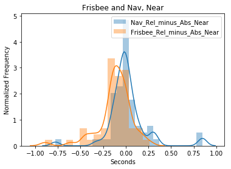


```python
doubleDistPlot('Frisbee_Rel_minus_Abs_Far','Nav_Rel_minus_Abs_Far',pivoted,abs_and_rel=False,title='Frisbee and Nav, Far')
```

    Frisbee_Rel_minus_Abs_Far (M = -0.12, SD = 0.17), 
    Nav_Rel_minus_Abs_Far (M = 0.17, SD = 0.17),
    t(57) = -4.98, p < 0.0001
    
    


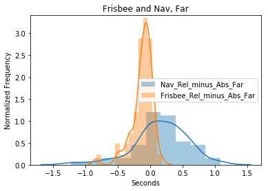


```python
doubleDistPlot('Frisbee_Rel_minus_Abs','Nav_Rel_minus_Abs',pivoted,abs_and_rel=False,title='Frisbee and Nav')
```

    Frisbee_Rel_minus_Abs (M = -0.12, SD = 0.13), 
    Nav_Rel_minus_Abs (M = 0.09, SD = 0.13),
    t(57) = -5.37, p < 0.0001
    
    


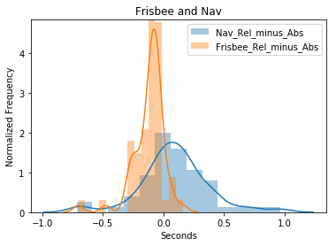


```python
forCorr = merged.iloc[:,0:8]
cols = forCorr.columns.tolist()
colsOrder = [1,3,5,7,0,2,4,6]
cols = [cols[i] for i in colsOrder]
forCorr = forCorr[cols]
corr = forCorr.corr()

# Set up the matplotlib figure
f, ax = plt.subplots(figsize=(11, 9))

# Generate a custom diverging colormap
cmap = sns.diverging_palette(220, 10, as_cmap=True)

# Draw the heatmap with the mask and correct aspect ratio
sns.heatmap(corr, center=0,
            square=True, linewidths=.5, cbar_kws={"shrink": .5})


```


    <matplotlib.axes._subplots.AxesSubplot at 0x1e181fabc88>


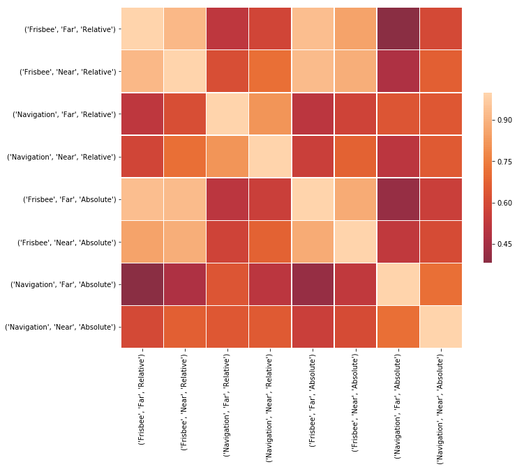


```python

from scipy.cluster.hierarchy import dendrogram,linkage
Z = linkage(forCorr.T)
plt.figure(figsize=(30,5))
dendrogram(Z,labels=forCorr.columns)
plt.show()
```


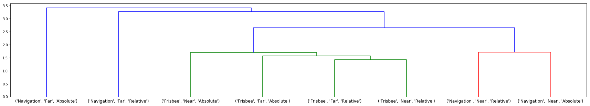


# Scatter plots, correlation between Relative and Absolute

Is there a correlation between relative and absolute preference across frisbee and navigation?

We plot the scatter with and without outliers. To see outlier detection, [go here](#bivariate_outliers)


```python
#Scatter plots

ax1 = sns.jointplot(pivoted['Nav_Rel_minus_Abs'], pivoted['Frisbee_Rel_minus_Abs'], kind="reg",size = 6)
ax1.set_axis_labels('Navigation Relative Minus Absolute', 'Frisbee Relative Minus Absolute')
plt.xlim(-.6,.6)
plt.ylim(-.6,.6)
ax1.fig.suptitle('Frisbee and Navigation')


#outliersBetween = ['52817250']
#noOutliersBetween = pivoted[~pivoted.index.isin(outliersBetween)]
#ax2 = sns.jointplot(noOutliersBetween['Nav_Rel_minus_Abs'], noOutliersBetween['Frisbee_Rel_minus_Abs'], kind="reg",size = 6)
#ax2.fig.suptitle('Frisbee and Navigation OUTLIERS REMOVED')

plt.tight_layout()
plt.show()

```


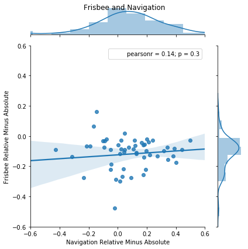


```python
# Frisbee near and far

ax3 = sns.jointplot(pivoted['Frisbee_Rel_minus_Abs_Near'], pivoted['Frisbee_Rel_minus_Abs_Far'], kind="reg", size =6)
ax3.fig.suptitle('Frisbee Near and Far')

#outliersFriz = ['44376975','99990726','26044874','52817250'] # from influence plot, below.
#noOutliersFriz = pivoted[~pivoted.index.isin(outliersFriz)]
#ax4 = sns.jointplot(noOutliersFriz['Frisbee_Rel_minus_Abs_Near'], noOutliersFriz['Frisbee_Rel_minus_Abs_Far'], kind="reg", size =6)
#ax4.fig.suptitle('Frisbee Near and Far OUTLIERS REMOVED')

plt.show()

```


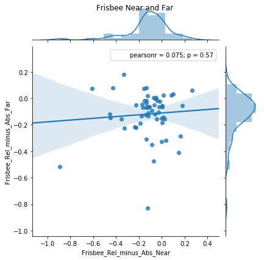


```python
# Navigation near and far
ax5 = sns.jointplot(pivoted['Nav_Rel_minus_Abs_Near'], pivoted['Nav_Rel_minus_Abs_Far'], kind="reg", size =6)
ax5.fig.suptitle('Navigation Near and Far')

#outliersNav = ['61216562','64824344','58839785'] # from influence plot, below.
#noOutliersNav = pivoted[~pivoted.index.isin(outliersNav)]
#ax6 = sns.jointplot(noOutliersNav['Nav_Rel_minus_Abs_Near'], noOutliersNav['Nav_Rel_minus_Abs_Far'], kind="reg", size =6)
#ax6.fig.suptitle('Navigation Near and Far OUTLIERS REMOVED')

plt.show()
```


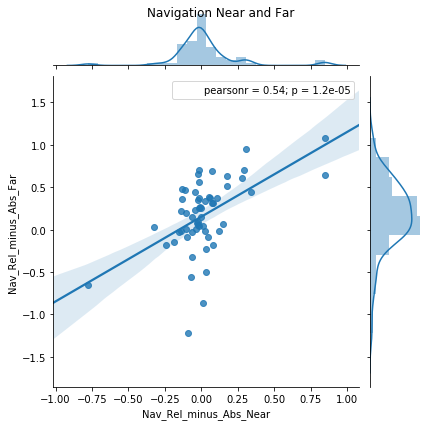


```python
# Frisbee experience
ax7 = sns.jointplot(merged[('Frisbee_Rel_minus_Abs','','')], merged['Friz_Total_Years_Played'], kind="reg", size =6)
ax7.fig.suptitle('Friz Rel vs. Abs and Experience')

#Navigation ability
ax8 = sns.jointplot(merged[('Nav_Rel_minus_Abs','','')], merged['SBSOD_AVERAGE'], kind="reg", size =6)
ax8.fig.suptitle('Nav Rel vs. Abs and Ability')

ax8 = sns.jointplot(merged[('Nav_Rel_minus_Abs','','')], merged['SBSOD_AVERAGE'], kind="reg", size =6)
ax8.fig.suptitle('Navigation and Experience')

ax8 = sns.jointplot(merged[('Frisbee_Rel_minus_Abs','','')], merged['Friz_Total_Years_Played'], kind="reg", size =6)
ax8.fig.suptitle('Frisbee and Experience')


plt.show()
```


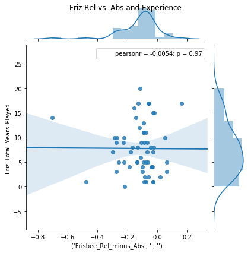


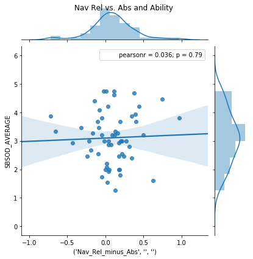


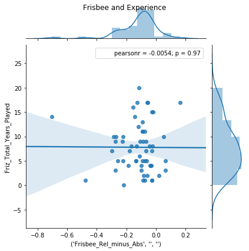


```python
# Line Graphs
sns.set_style('ticks')
sns.set_context('talk')
ax1 = sns.factorplot(x = "promptType", y = "Trials_responsert", data = dataForPlot, hue = "stimLoc",palette=['red','blue'], 
                     kind = "point", size = 8,col='condition')
ax1.set(xlabel='Prompt Label', ylabel='Response Time (s)')
ax1.set_titles("{col_name} Condition")

ax2 = sns.factorplot(x = "prompt1", y = "Trials_responsert", data = dataForPlot, hue = "stim1", palette=['red','salmon','blue','dodgerblue'],
                    kind = "point", size = 8,col='condition', order=['Right','Left','Away','Home'], hue_order=['near_right','near_left','far_right','far_left'])

ax2.set(xlabel='Prompt Label', ylabel='Response Time (s)')
ax2.set_titles("{col_name} Condition")

plt.show()
```


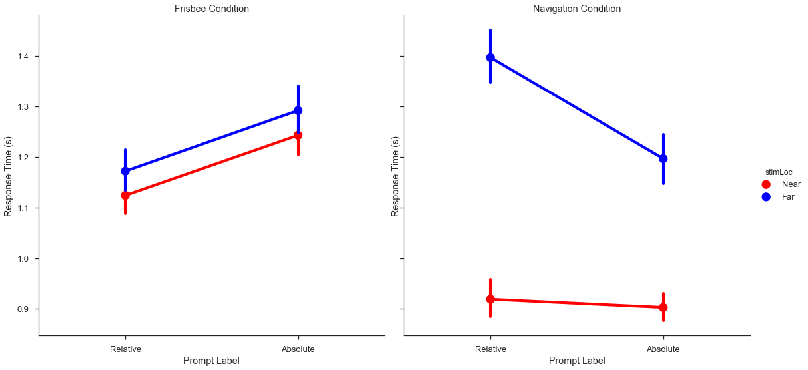


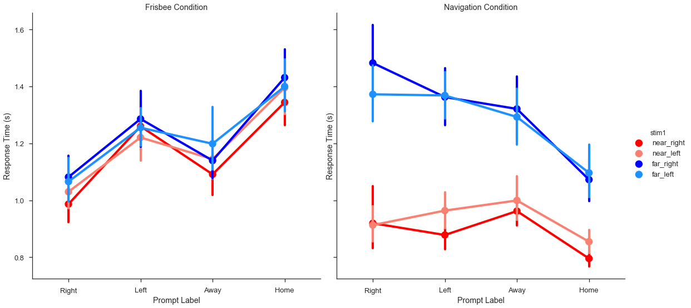


```python

plt.figure()
ax6 = sns.boxplot(data=merged,x='Friz_Force_Preference',y="Frisbee")
plt.figure()
ax7 = sns.boxplot(data=merged,x='Sex',y="Frisbee")
plt.figure()
ax8 = sns.boxplot(data=merged,x='Sex',y="Navigation")
plt.figure()
ax9 = sns.boxplot(data=merged,x='Friz_Force_Preference',y="Navigation")


```


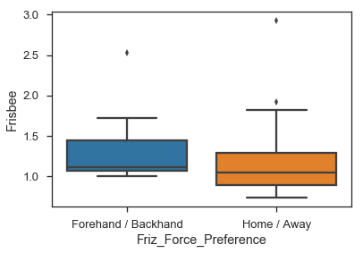


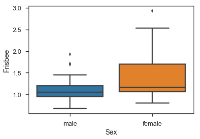


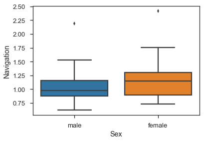


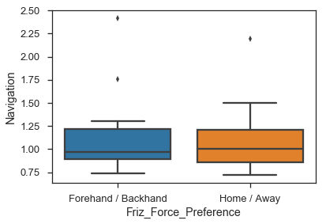


# Outlier Detection
<a id='bivariate_outliers'></a>


```python
#Plot influence graph of outliers

fig,ax = plt.subplots(figsize=(12,8))
lm = sm.OLS(pivoted['Nav_Rel_minus_Abs_Near'], pivoted['Nav_Rel_minus_Abs_Far']).fit()
fig = sm.graphics.influence_plot(lm,alpha=0.05,ax=ax,criterion="cooks")

```


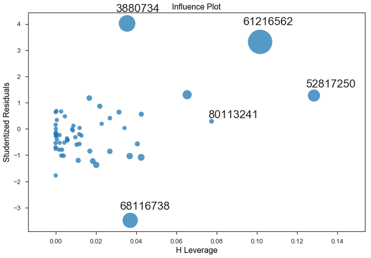


```python

#Greater rel bias for nav than friz
ttestdata = pivoted['Nav_Rel_minus_Abs']-pivoted['Frisbee_Rel_minus_Abs']
t,prob = scipy.stats.ttest_1samp(ttestdata,0)

fb = merged[merged['Friz_Force_Preference'] == 'Forehand / Backhand']
ha = merged[merged['Friz_Force_Preference'] == 'Home / Away']
 
   
t = []
p = []
for i,j in enumerate(fb):
    if fb[j].dtype == 'float64':
        print(j, scipy.stats.ttest_ind(fb[j],ha[j]))
    
m = merged[merged['Sex'] == 'male']
f = merged[merged['Sex'] == 'female']

t2 = []
p2 = []
for i,j in enumerate(f):
    if f[j].dtype == 'float64':
        print(j, scipy.stats.ttest_ind(m[j],f[j]))

#T-Tests 2 
        
h = merged[merged['Friz_Position'].isin(['Handler','Both'])]
cb = merged[merged['Friz_Position'] == 'Cutter']  

for i,j in enumerate(h):
    if h[j].dtype == 'float64':
        print(j, scipy.stats.ttest_ind(h[j],cb[j]))
 
    
```

    ('Frisbee', 'Far', 'Absolute') Ttest_indResult(statistic=0.9603559867390095, pvalue=0.3415912172633392)
    ('Frisbee', 'Far', 'Relative') Ttest_indResult(statistic=0.68892463575963, pvalue=0.4941200105765181)
    ('Frisbee', 'Near', 'Absolute') Ttest_indResult(statistic=1.2612670135490458, pvalue=0.21318452448293904)
    ('Frisbee', 'Near', 'Relative') Ttest_indResult(statistic=0.8979892770288048, pvalue=0.3735826242663023)
    ('Navigation', 'Far', 'Absolute') Ttest_indResult(statistic=-0.7709176208817472, pvalue=0.44445730667540895)
    ('Navigation', 'Far', 'Relative') Ttest_indResult(statistic=1.1795890536195788, pvalue=0.24385922102402754)
    ('Navigation', 'Near', 'Absolute') Ttest_indResult(statistic=-0.41413000137428185, pvalue=0.6805861606661914)
    ('Navigation', 'Near', 'Relative') Ttest_indResult(statistic=0.9035319021286262, pvalue=0.37066432544751027)
    ('Frisbee_Rel_minus_Abs_Far', '', '') Ttest_indResult(statistic=-0.9000713166265376, pvalue=0.3724846753670016)
    ('Frisbee_Rel_minus_Abs_Near', '', '') Ttest_indResult(statistic=-0.7298038764494753, pvalue=0.468984742335818)
    ('Frisbee_Rel_minus_Abs', '', '') Ttest_indResult(statistic=-1.0834064765056195, pvalue=0.2839304789999085)
    ('Nav_Rel_minus_Abs_Far', '', '') Ttest_indResult(statistic=2.514519819000356, pvalue=0.015251948477306222)
    ('Nav_Rel_minus_Abs_Near', '', '') Ttest_indResult(statistic=1.6033233549202712, pvalue=0.11529061361991917)
    ('Nav_Rel_minus_Abs', '', '') Ttest_indResult(statistic=2.4640502873876815, pvalue=0.01729397446609238)
    SBSOD_AVERAGE Ttest_indResult(statistic=1.4022634646784833, pvalue=0.16714035074599426)
    Frisbee Ttest_indResult(statistic=1.025632018846615, pvalue=0.31010181076162385)
    Navigation Ttest_indResult(statistic=0.28010256460983196, pvalue=0.7805779516429334)
    ('Frisbee', 'Far', 'Absolute') Ttest_indResult(statistic=-2.7006738604829725, pvalue=0.009136541698049097)
    ('Frisbee', 'Far', 'Relative') Ttest_indResult(statistic=-3.131384329208021, pvalue=0.0027648017367648287)
    ('Frisbee', 'Near', 'Absolute') Ttest_indResult(statistic=-2.800346766525892, pvalue=0.006992994980260993)
    ('Frisbee', 'Near', 'Relative') Ttest_indResult(statistic=-2.8236215686080195, pvalue=0.006564326513762934)
    ('Navigation', 'Far', 'Absolute') Ttest_indResult(statistic=0.024306408223962562, pvalue=0.9806946085547483)
    ('Navigation', 'Far', 'Relative') Ttest_indResult(statistic=-2.511309122250148, pvalue=0.014940253574117756)
    ('Navigation', 'Near', 'Absolute') Ttest_indResult(statistic=-0.583648899891305, pvalue=0.5618000738701528)
    ('Navigation', 'Near', 'Relative') Ttest_indResult(statistic=-2.985966849752819, pvalue=0.004186857120948421)
    ('Frisbee_Rel_minus_Abs_Far', '', '') Ttest_indResult(statistic=-0.4290196253216376, pvalue=0.6695549241868859)
    ('Frisbee_Rel_minus_Abs_Near', '', '') Ttest_indResult(statistic=-0.1526267107680904, pvalue=0.8792412616206859)
    ('Frisbee_Rel_minus_Abs', '', '') Ttest_indResult(statistic=-0.38496817867918276, pvalue=0.7017192667462075)
    ('Nav_Rel_minus_Abs_Far', '', '') Ttest_indResult(statistic=-2.9172903411612348, pvalue=0.00507319910833571)
    ('Nav_Rel_minus_Abs_Near', '', '') Ttest_indResult(statistic=-3.0842926244829783, pvalue=0.003166360924208106)
    ('Nav_Rel_minus_Abs', '', '') Ttest_indResult(statistic=-3.418769307087931, pvalue=0.0011794034697525286)
    SBSOD_AVERAGE Ttest_indResult(statistic=-2.0175624655417015, pvalue=0.04843881762247471)
    Frisbee Ttest_indResult(statistic=-2.9931188128575736, pvalue=0.00410335585759753)
    Navigation Ttest_indResult(statistic=-1.6287049483252323, pvalue=0.10898894392747421)
    ('Frisbee', 'Far', 'Absolute') Ttest_indResult(statistic=-0.5576460430302691, pvalue=0.5793085560247593)
    ('Frisbee', 'Far', 'Relative') Ttest_indResult(statistic=-0.11511367320820333, pvalue=0.9087667953395323)
    ('Frisbee', 'Near', 'Absolute') Ttest_indResult(statistic=-0.9463520976018173, pvalue=0.34803476023714597)
    ('Frisbee', 'Near', 'Relative') Ttest_indResult(statistic=-0.9315411432256516, pvalue=0.3555725130791271)
    ('Navigation', 'Far', 'Absolute') Ttest_indResult(statistic=0.3829053061827943, pvalue=0.7032395894062147)
    ('Navigation', 'Far', 'Relative') Ttest_indResult(statistic=0.04664577213835529, pvalue=0.9629615027592839)
    ('Navigation', 'Near', 'Absolute') Ttest_indResult(statistic=0.006778884809118621, pvalue=0.9946153656367579)
    ('Navigation', 'Near', 'Relative') Ttest_indResult(statistic=-0.11593231815295972, pvalue=0.908120921681492)
    ('Frisbee_Rel_minus_Abs_Far', '', '') Ttest_indResult(statistic=1.2983239913688454, pvalue=0.1994976045569614)
    ('Frisbee_Rel_minus_Abs_Near', '', '') Ttest_indResult(statistic=-0.00899074976539712, pvalue=0.9928584693438302)
    ('Frisbee_Rel_minus_Abs', '', '') Ttest_indResult(statistic=0.8179338960242161, pvalue=0.41686167148097053)
    ('Nav_Rel_minus_Abs_Far', '', '') Ttest_indResult(statistic=-0.4147676751843112, pvalue=0.6798966696761455)
    ('Nav_Rel_minus_Abs_Near', '', '') Ttest_indResult(statistic=-0.15415609209957912, pvalue=0.8780408845038413)
    ('Nav_Rel_minus_Abs', '', '') Ttest_indResult(statistic=-0.36357115379512184, pvalue=0.7175472489154621)
    SBSOD_AVERAGE Ttest_indResult(statistic=2.685839785161704, pvalue=0.009502730787628116)
    Frisbee Ttest_indResult(statistic=-0.6816670132483584, pvalue=0.49825913022930646)
    Navigation Ttest_indResult(statistic=0.1335863931860047, pvalue=0.8942085580047344)
    
