# Data analysis for the Ultimate Refriz Frames Project
(To see associated experimental stimuli script, [go here](https://bitbucket.org/smweis/frizrf/overview)
We import the necessary modules, and one custom function that wraps up data importing.

This creates three datasets: 

**data** -> Data from all trials.

**all_answers_data** -> No High RTs

**unthreshed_data** -> no High RTs, no incorrect answers.

**dataForPlot** -> Set in Cell 2 - the data that will be displayed. 


```python
#Load and clean data.

%matplotlib inline
import numpy as np
import matplotlib.pyplot as plt
import seaborn as sns
import pandas as pd
import scipy
import statsmodels.api as sm
#import statsmodels.formula.api as smf

#custom function
from importData import getData

#Get Data
frizData = getData('C:\\Users\\stweis\\Dropbox\\Penn Post Doc\\Frisbee_Ref_Frames\\data\\batch1\\friz_clean')
navData = getData('C:\\Users\\stweis\\Dropbox\\Penn Post Doc\\Frisbee_Ref_Frames\\data\\batch1\\nav_clean')
additionalData = pd.read_excel('C:\\Users\\stweis\\Dropbox\\Penn Post Doc\\Frisbee_Ref_Frames\\data\\batch1\\additionalData_For_Python.xlsx',header=0)
#Recode "psychopycode to participant"
additionalData['participant'] = additionalData['psychopycode']

#Clean data functions
def removeHighRTs(howManySDs,dv,data):
    rtThresh = howManySDs*np.std(data[dv])
    rtMean = np.mean(data[dv])
    dataThresh = data.loc[data[dv] < (rtMean + rtThresh)]
    dataThresh = dataThresh.loc[dataThresh[dv] > 0]
    return dataThresh


def removeWrongAnswers(dv,data):
    dataCorrect = data.loc[data[dv] == 1]
    return dataCorrect


def renameFactorLevels(data,friz_or_nav):
    data['condition'] = friz_or_nav
    prompts = sorted(data.prompt1.unique())
    stims = sorted(data.stim1.unique())
    new_stims = ['far_left','far_right','near_left','near_right']

    if friz_or_nav == 'friz':    
        new_prompts = ['Away','Left','Right','Home']
    else:
        new_prompts = ['Away','Home','Left','Right']
        
    for i in range(len(prompts)):
        data = data.replace(prompts[i],new_prompts[i])
        data = data.replace(stims[i],new_stims[i])
        
    return data


def newFactorPrompts(row):
    if row['prompt1'] == 'Home' or row['prompt1'] == 'Away':
        return 'Absolute'
    else:
        return 'Relative'

    
def newFactorStims(row):
    if row['stim1'] == 'near_right' or row['stim1'] == 'near_left':
        return 'Near'
    else:
        return 'Far'
    

#Rename conditions
frizData = renameFactorLevels(frizData,'Frisbee')
navData = renameFactorLevels(navData,'Navigation')
#Recode stimulus location to a binary variable.
frizData['stimLoc'] = frizData.apply(lambda row: newFactorStims(row),axis=1)
navData['stimLoc'] = navData.apply(lambda row: newFactorStims(row),axis=1)
#Recode prompt type to a binary variable. 
frizData['promptType'] = frizData.apply(lambda row: newFactorPrompts(row),axis=1)
navData['promptType'] = navData.apply(lambda row: newFactorPrompts(row),axis=1)

#Threshold data at 2 RT's above mean.
frizDataThresh = removeHighRTs(2, 'Trials_responsert',frizData)
navDataThresh = removeHighRTs(2, 'Trials_responsert',navData)


all_answers_data = frizDataThresh.append(navDataThresh)


data = removeWrongAnswers('Trials_responsecorr',all_answers_data)

unthreshed_data = frizData.append(navData)

neccessaryAdditionalData = additionalData.loc[:,
                                              ["Sex","participant",
                                               "SBSOD_AVERAGE",
                                               "Friz_Total_Years_Played",
                                               "Friz_Force_Preference",
                                               "Friz_Position"]]


```

    C:\Users\stweis\AppData\Local\Continuum\anaconda3\lib\site-packages\statsmodels\compat\pandas.py:56: FutureWarning: The pandas.core.datetools module is deprecated and will be removed in a future version. Please use the pandas.tseries module instead.
      from pandas.core import datetools
    


```python
def chooseYourData():

    while True:
        try:
            whichData = int(input("Trimmed RT, Correct Answers=1, Trimmed RT, All Answers=2, All Answers=3: "))
            break
        except ValueError:
            print("Pick 1, 2, or 3")
    if whichData == 1:
        dfp = data
    elif whichData == 2:
        dfp = all_answers_data
    elif whichData == 3:
        dfp = unthreshed_data
    else:
        chooseYourData()

    return dfp

dataForPlot = chooseYourData()
```

    Trimmed RT, Correct Answers=1, Trimmed RT, All Answers=2, All Answers=3: a
    Pick 1, 2, or 3
    Trimmed RT, Correct Answers=1, Trimmed RT, All Answers=2, All Answers=3: wes
    Pick 1, 2, or 3
    Trimmed RT, Correct Answers=1, Trimmed RT, All Answers=2, All Answers=3: 1
    


```python
#Pivot and recode data.

pivoted = dataForPlot.pivot_table(index='participant',columns=['condition','stimLoc','promptType'],
                                  values='Trials_responsert',aggfunc=np.mean)

#pivoted.isnull().sum() #To see how many cells have no data. 
pivoted = pivoted.dropna() #otherwise this won't work - so some data is missing

pivoted['Frisbee_Rel_minus_Abs_Far'] = pivoted['Frisbee']['Far']['Relative'] - pivoted['Frisbee']['Far']['Absolute']
pivoted['Frisbee_Rel_minus_Abs_Near'] = pivoted['Frisbee']['Near']['Relative'] - pivoted['Frisbee']['Near']['Absolute']
pivoted['Frisbee_Rel_minus_Abs'] = (pivoted['Frisbee_Rel_minus_Abs_Far'] + pivoted['Frisbee_Rel_minus_Abs_Near'])/2
pivoted['Nav_Rel_minus_Abs_Far'] = pivoted['Navigation']['Far']['Relative'] - pivoted['Navigation']['Far']['Absolute']
pivoted['Nav_Rel_minus_Abs_Near'] = pivoted['Navigation']['Near']['Relative'] - pivoted['Navigation']['Near']['Absolute']
pivoted['Nav_Rel_minus_Abs'] = (pivoted['Nav_Rel_minus_Abs_Far'] + pivoted['Nav_Rel_minus_Abs_Near'])/2

pivotedAllFour = dataForPlot.pivot_table(index='participant',columns=['condition','prompt1'],values='Trials_responsert',aggfunc=np.mean)
pivotedAllFour['Friz_Back_minus_Fore'] = pivotedAllFour['Frisbee']['Left'] - pivotedAllFour['Frisbee']['Right']
pivotedAllFour['Friz_Home_minus_Away'] = pivotedAllFour['Frisbee']['Home'] - pivotedAllFour['Frisbee']['Away']
pivotedAllFour['Nav_Left_minus_Right'] = pivotedAllFour['Navigation']['Left'] - pivotedAllFour['Navigation']['Right']
pivotedAllFour['Nav_Home_minus_Away'] = pivotedAllFour['Navigation']['Home'] - pivotedAllFour['Navigation']['Away']
pivoted.sort_index(inplace=True)
pivotedAllFour.sort_index(inplace=True)

# Merges pivoted data with additional data (columns from necessaryAdditionalData)
grandmean = dataForPlot.pivot_table(index='participant',columns=['condition'],values='Trials_responsert',aggfunc=np.mean)
pivoted['participant'] = pivoted.index
pivoted[['participant']] = pivoted[['participant']].apply(pd.to_numeric)
neccessaryAdditionalData.sort_values('participant',inplace=True)
pivoted.sort_values('participant',inplace=True)
merged = pivoted.merge(neccessaryAdditionalData,on='participant')
grandmean['participant'] = grandmean.index
grandmean[['participant']] = grandmean[['participant']].apply(pd.to_numeric)

merged = merged.merge(grandmean,on='participant')


```

    C:\Users\stweis\AppData\Local\Continuum\anaconda3\lib\site-packages\pandas\core\reshape\merge.py:558: UserWarning: merging between different levels can give an unintended result (3 levels on the left, 1 on the right)
      warnings.warn(msg, UserWarning)
    


```python

ax1 = sns.distplot(pivoted['Nav_Rel_minus_Abs'],label='Navigation')
sns.distplot(pivoted['Frisbee_Rel_minus_Abs'],label='Frisbee')
ax1.set(xlabel='Difference between Relative and Absolute Prompts',ylabel='Frequency')
plt.legend()
plt.text(-1.3,-.6,'Abs is Faster', color='red')
plt.text(1,-.6,'Rel is Faster', color='red')

plt.show()
```


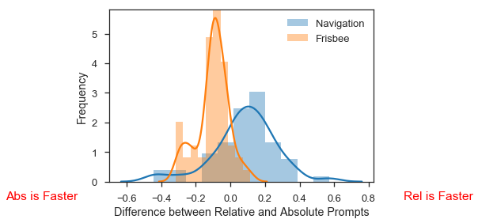


```python
forCorr = merged.iloc[:,1:9]
cols = forCorr.columns.tolist()
colsOrder = [1,3,5,7,0,2,4,6]
cols = [cols[i] for i in colsOrder]
forCorr = forCorr[cols]
corr = forCorr.corr()

# Set up the matplotlib figure
f, ax = plt.subplots(figsize=(11, 9))

# Generate a custom diverging colormap
cmap = sns.diverging_palette(220, 10, as_cmap=True)

# Draw the heatmap with the mask and correct aspect ratio
sns.heatmap(corr, center=0,
            square=True, linewidths=.5, cbar_kws={"shrink": .5})


```


    <matplotlib.axes._subplots.AxesSubplot at 0x1998cb84080>


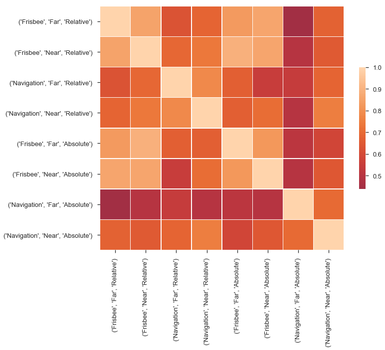


```python

from scipy.cluster.hierarchy import dendrogram,linkage
Z = linkage(forCorr.T)
plt.figure(figsize=(30,5))
dendrogram(Z,labels=forCorr.columns)
plt.show()
```


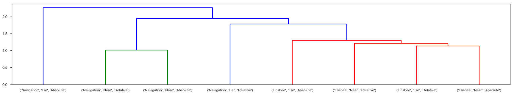


```python
# Line Graphs
sns.set_style('ticks')
sns.set_context('talk')
ax1 = sns.factorplot(x = "promptType", y = "Trials_responsert", data = dataForPlot, hue = "stimLoc",palette=['red','blue'], 
                     kind = "point", size = 8,col='condition')
ax1.set(xlabel='Prompt Label', ylabel='Response Time (s)')
ax1.set_titles("{col_name} Condition")

ax2 = sns.factorplot(x = "prompt1", y = "Trials_responsert", data = dataForPlot, hue = "stim1", palette=['red','salmon','blue','dodgerblue'],
                    kind = "point", size = 8,col='condition', order=['Right','Left','Away','Home'], hue_order=['near_right','near_left','far_right','far_left'])

ax2.set(xlabel='Prompt Label', ylabel='Response Time (s)')
ax2.set_titles("{col_name} Condition")

plt.show()
```


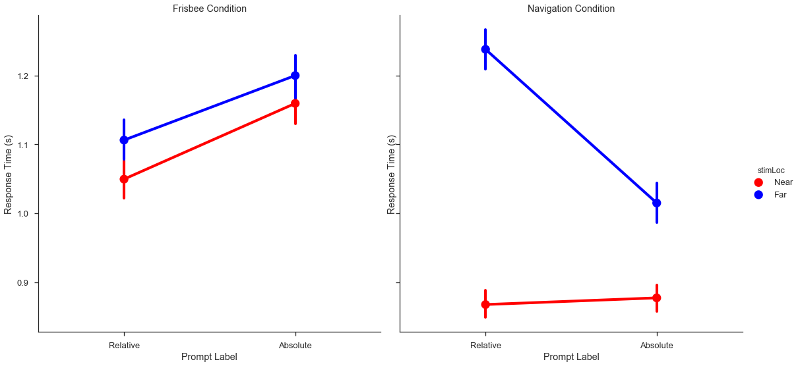


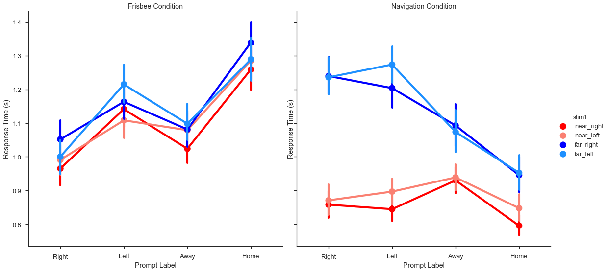


# Scatter plots, correlation between Relative and Absolute

Is there a correlation between relative and absolute preference across frisbee and navigation?

We plot the scatter with and without outliers. To see outlier detection, [go here](#bivariate_outliers)


```python
#Scatter plots

ax1 = sns.jointplot(pivoted['Nav_Rel_minus_Abs'], pivoted['Frisbee_Rel_minus_Abs'], kind="reg",size = 6)
ax1.set_axis_labels('Navigation Relative Minus Absolute', 'Frisbee Relative Minus Absolute')
plt.xlim(-.6,.6)
plt.ylim(-.6,.6)
ax1.fig.suptitle('Frisbee and Navigation')


outliersBetween = ['52817250']
noOutliersBetween = pivoted[~pivoted.participant.isin(outliersBetween)]
ax2 = sns.jointplot(noOutliersBetween['Nav_Rel_minus_Abs'], noOutliersBetween['Frisbee_Rel_minus_Abs'], kind="reg",size = 6)
ax2.fig.suptitle('Frisbee and Navigation OUTLIERS REMOVED')

plt.tight_layout()
plt.show()

```


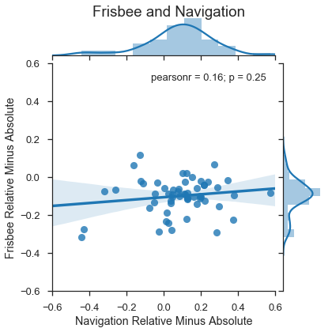


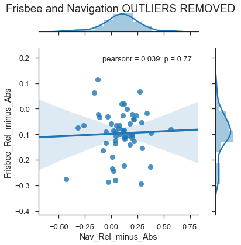


```python
# Frisbee near and far

ax3 = sns.jointplot(pivoted['Frisbee_Rel_minus_Abs_Near'], pivoted['Frisbee_Rel_minus_Abs_Far'], kind="reg", size =6)
ax3.fig.suptitle('Frisbee Near and Far')

outliersFriz = ['44376975','99990726','26044874','52817250'] # from influence plot, below.
noOutliersFriz = pivoted[~pivoted.participant.isin(outliersFriz)]
ax4 = sns.jointplot(noOutliersFriz['Frisbee_Rel_minus_Abs_Near'], noOutliersFriz['Frisbee_Rel_minus_Abs_Far'], kind="reg", size =6)
ax4.fig.suptitle('Frisbee Near and Far OUTLIERS REMOVED')

plt.show()

```


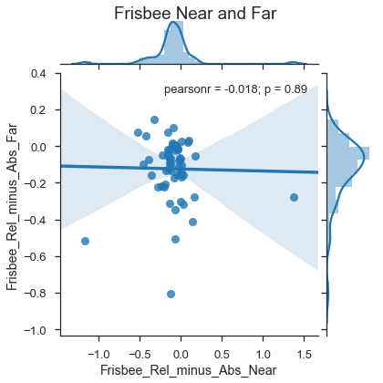


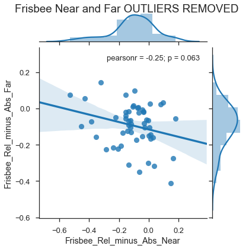


```python
# Navigation near and far
ax5 = sns.jointplot(pivoted['Nav_Rel_minus_Abs_Near'], pivoted['Nav_Rel_minus_Abs_Far'], kind="reg", size =6)
ax5.fig.suptitle('Navigation Near and Far')

outliersNav = ['61216562','64824344','58839785'] # from influence plot, below.
noOutliersNav = pivoted[~pivoted.participant.isin(outliersNav)]
ax6 = sns.jointplot(noOutliersNav['Nav_Rel_minus_Abs_Near'], noOutliersNav['Nav_Rel_minus_Abs_Far'], kind="reg", size =6)
ax6.fig.suptitle('Navigation Near and Far OUTLIERS REMOVED')

plt.show()
```


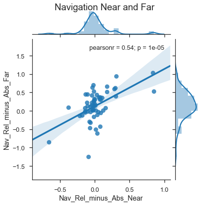


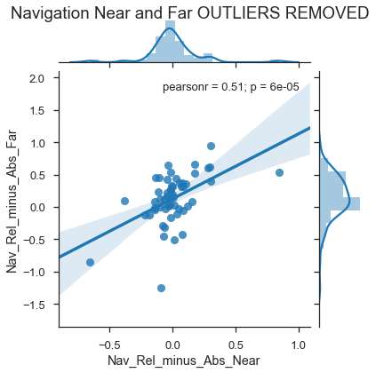


```python

plt.figure()
ax6 = sns.boxplot(data=merged,x='Friz_Force_Preference',y="Frisbee")
plt.figure()
ax7 = sns.boxplot(data=merged,x='Sex',y="Frisbee")
plt.figure()
ax8 = sns.boxplot(data=merged,x='Sex',y="Navigation")
plt.figure()
ax9 = sns.boxplot(data=merged,x='Friz_Force_Preference',y="Navigation")


```


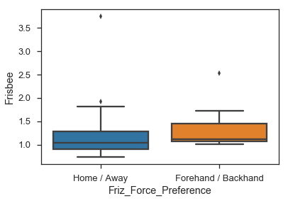


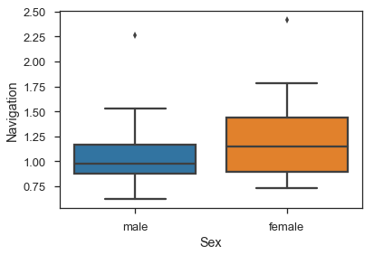


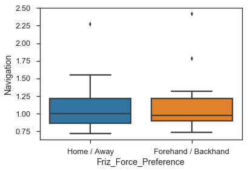


# Outlier Detection
<a id='bivariate_outliers'></a>


```python
#Plot influence graph of outliers

fig,ax = plt.subplots(figsize=(12,8))
lm = sm.OLS(pivoted['Nav_Rel_minus_Abs_Near'], pivoted['Nav_Rel_minus_Abs_Far']).fit()
fig = sm.graphics.influence_plot(lm,alpha=0.05,ax=ax,criterion="cooks")

```


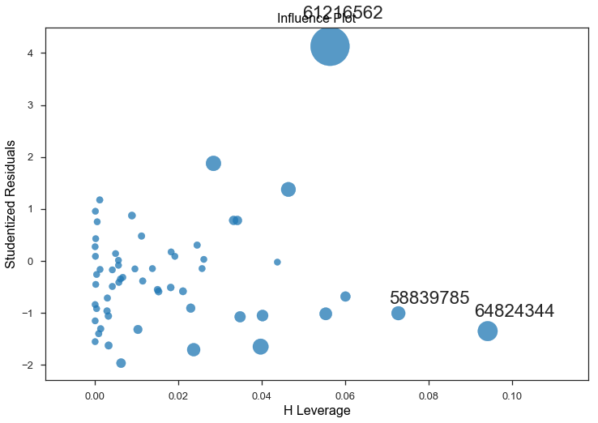


```python

#Greater rel bias for nav than friz
ttestdata = pivoted['Nav_Rel_minus_Abs']-pivoted['Frisbee_Rel_minus_Abs']
t,prob = scipy.stats.ttest_1samp(ttestdata,0)

fb = merged[merged['Friz_Force_Preference'] == 'Forehand / Backhand']
ha = merged[merged['Friz_Force_Preference'] == 'Home / Away']
 
   
t = []
p = []
for i,j in enumerate(fb):
    if fb[j].dtype == 'float64':
        print(j, scipy.stats.ttest_ind(fb[j],ha[j]))
    
m = merged[merged['Sex'] == 'male']
f = merged[merged['Sex'] == 'female']

t2 = []
p2 = []
for i,j in enumerate(f):
    if f[j].dtype == 'float64':
        print(j, scipy.stats.ttest_ind(m[j],f[j]))

#T-Tests 2 
        
h = merged[merged['Friz_Position'].isin(['Handler','Both'])]
cb = merged[merged['Friz_Position'] == 'Cutter']  

for i,j in enumerate(h):
    if h[j].dtype == 'float64':
        print(j, scipy.stats.ttest_ind(h[j],cb[j]))
 
    
```

    ('Frisbee', 'Far', 'Absolute') Ttest_indResult(statistic=2.4522149852269566, pvalue=0.017885455997762874)
    ('Frisbee', 'Far', 'Relative') Ttest_indResult(statistic=1.6468745799268134, pvalue=0.1061162614641616)
    ('Frisbee', 'Near', 'Absolute') Ttest_indResult(statistic=2.025524327389497, pvalue=0.04839288896436438)
    ('Frisbee', 'Near', 'Relative') Ttest_indResult(statistic=2.1381236580134018, pvalue=0.03762546781912048)
    ('Navigation', 'Far', 'Absolute') Ttest_indResult(statistic=-0.7679649885884394, pvalue=0.4462696972477229)
    ('Navigation', 'Far', 'Relative') Ttest_indResult(statistic=1.4686310042582138, pvalue=0.1484563573392125)
    ('Navigation', 'Near', 'Absolute') Ttest_indResult(statistic=0.2369324681106807, pvalue=0.8137174706779016)
    ('Navigation', 'Near', 'Relative') Ttest_indResult(statistic=1.3549400270318182, pvalue=0.18177953428290008)
    ('Frisbee_Rel_minus_Abs_Far', '', '') Ttest_indResult(statistic=-1.4616213402066924, pvalue=0.15036125380756005)
    ('Frisbee_Rel_minus_Abs_Near', '', '') Ttest_indResult(statistic=0.07760873797114425, pvalue=0.9384619054661755)
    ('Frisbee_Rel_minus_Abs', '', '') Ttest_indResult(statistic=-1.266285185658427, pvalue=0.21152196133040743)
    ('Nav_Rel_minus_Abs_Far', '', '') Ttest_indResult(statistic=2.2607632121942958, pvalue=0.02834545715316166)
    ('Nav_Rel_minus_Abs_Near', '', '') Ttest_indResult(statistic=1.7659108276223148, pvalue=0.08377059672937033)
    ('Nav_Rel_minus_Abs', '', '') Ttest_indResult(statistic=2.471589070335068, pvalue=0.0170504558307526)
    SBSOD_AVERAGE Ttest_indResult(statistic=1.4983481798803109, pvalue=0.1405910229928964)
    Frisbee Ttest_indResult(statistic=2.16006408348174, pvalue=0.035791260777175704)
    Navigation Ttest_indResult(statistic=0.7375521239285256, pvalue=0.464377070453158)
    ('Frisbee', 'Far', 'Absolute') Ttest_indResult(statistic=-2.2322600797141297, pvalue=0.029689614839300424)
    ('Frisbee', 'Far', 'Relative') Ttest_indResult(statistic=-3.3914122275119265, pvalue=0.0012939343277334646)
    ('Frisbee', 'Near', 'Absolute') Ttest_indResult(statistic=-2.9537811348501513, pvalue=0.00461137590692934)
    ('Frisbee', 'Near', 'Relative') Ttest_indResult(statistic=-2.5495899319862976, pvalue=0.013602561705418308)
    ('Navigation', 'Far', 'Absolute') Ttest_indResult(statistic=-0.44784584465864996, pvalue=0.6560235588809114)
    ('Navigation', 'Far', 'Relative') Ttest_indResult(statistic=-2.1281455781905514, pvalue=0.03782103736733017)
    ('Navigation', 'Near', 'Absolute') Ttest_indResult(statistic=-1.4618236552653858, pvalue=0.1494800120044577)
    ('Navigation', 'Near', 'Relative') Ttest_indResult(statistic=-2.7135168784912076, pvalue=0.008871964198863385)
    ('Frisbee_Rel_minus_Abs_Far', '', '') Ttest_indResult(statistic=-1.355795316368127, pvalue=0.18070528407892733)
    ('Frisbee_Rel_minus_Abs_Near', '', '') Ttest_indResult(statistic=0.7985449348727475, pvalue=0.4279891291967699)
    ('Frisbee_Rel_minus_Abs', '', '') Ttest_indResult(statistic=-0.5680514623237168, pvalue=0.5723119210561028)
    ('Nav_Rel_minus_Abs_Far', '', '') Ttest_indResult(statistic=-1.504855506335373, pvalue=0.13808276349032386)
    ('Nav_Rel_minus_Abs_Near', '', '') Ttest_indResult(statistic=-2.1924455880975167, pvalue=0.03259649693654815)
    ('Nav_Rel_minus_Abs', '', '') Ttest_indResult(statistic=-1.9856214975176896, pvalue=0.05206968419858526)
    SBSOD_AVERAGE Ttest_indResult(statistic=-2.105834278606154, pvalue=0.03979778578590615)
    Frisbee Ttest_indResult(statistic=-2.9965855386237634, pvalue=0.004090202171292427)
    Navigation Ttest_indResult(statistic=-1.9015044660313305, pvalue=0.0624794228470834)
    ('Frisbee', 'Far', 'Absolute') Ttest_indResult(statistic=-1.4044134213323474, pvalue=0.1658180596256405)
    ('Frisbee', 'Far', 'Relative') Ttest_indResult(statistic=-0.345011837331204, pvalue=0.7314014241807663)
    ('Frisbee', 'Near', 'Absolute') Ttest_indResult(statistic=-1.1710905170572377, pvalue=0.24661116656948054)
    ('Frisbee', 'Near', 'Relative') Ttest_indResult(statistic=-1.4452289844015502, pvalue=0.15406746919168468)
    ('Navigation', 'Far', 'Absolute') Ttest_indResult(statistic=1.5022790062240938, pvalue=0.13874522762169655)
    ('Navigation', 'Far', 'Relative') Ttest_indResult(statistic=-0.1389184453141628, pvalue=0.890022011473808)
    ('Navigation', 'Near', 'Absolute') Ttest_indResult(statistic=1.1853419160468603, pvalue=0.24097853425676102)
    ('Navigation', 'Near', 'Relative') Ttest_indResult(statistic=-0.42711264911665775, pvalue=0.6709647243239176)
    ('Frisbee_Rel_minus_Abs_Far', '', '') Ttest_indResult(statistic=1.942359387042672, pvalue=0.057221004428706014)
    ('Frisbee_Rel_minus_Abs_Near', '', '') Ttest_indResult(statistic=-0.42977238635523496, pvalue=0.6690403596252434)
    ('Frisbee_Rel_minus_Abs', '', '') Ttest_indResult(statistic=1.353071805275867, pvalue=0.1815684922313935)
    ('Nav_Rel_minus_Abs_Far', '', '') Ttest_indResult(statistic=-1.8154173726015261, pvalue=0.07491305757754516)
    ('Nav_Rel_minus_Abs_Near', '', '') Ttest_indResult(statistic=-2.16927750716991, pvalue=0.03440088481218073)
    ('Nav_Rel_minus_Abs', '', '') Ttest_indResult(statistic=-2.2313849482886035, pvalue=0.029750963438243756)
    SBSOD_AVERAGE Ttest_indResult(statistic=2.866970369565183, pvalue=0.005863168863151955)
    Frisbee Ttest_indResult(statistic=-1.1251230769718648, pvalue=0.2654229877389221)
    Navigation Ttest_indResult(statistic=0.28051498540522896, pvalue=0.7801349067357105)
    
